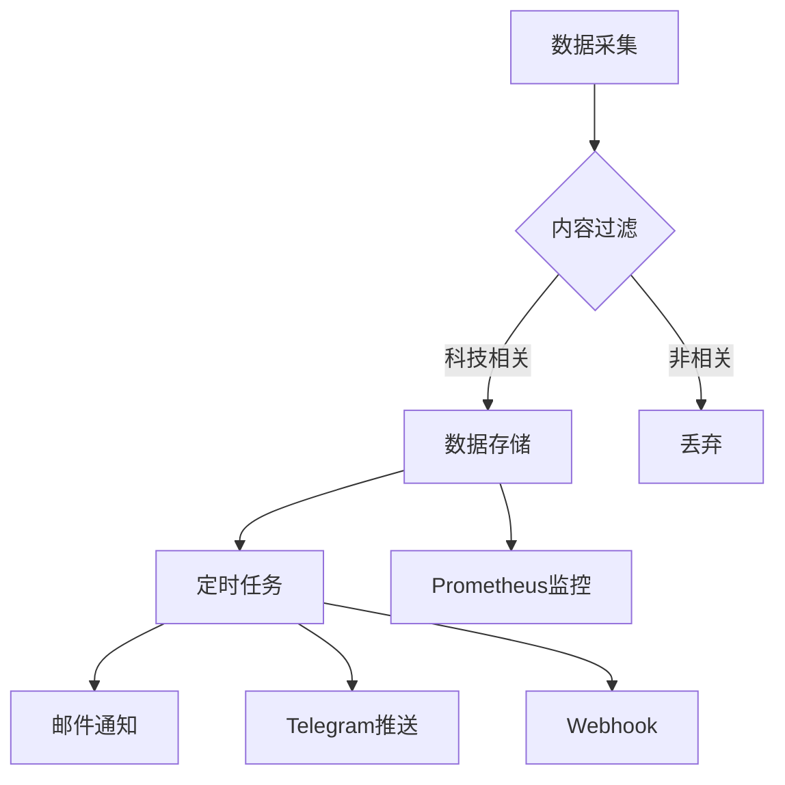

# Tech News Monitor 🚀

全球科技热点实时监测系统 | 每小时自动采集、分析、推送最新技术动态

[](https://www.python.org/)
[](https://opensource.org/licenses/MIT)
[](https://prometheus.io/)

## 功能特性 ✨

- **多源采集**：聚合NewsAPI、GitHub趋势、RSS等15+数据源
- **智能过滤**：基于TF-IDF与关键词的科技内容识别
- **实时推送**：支持邮件/Telegram/Webhook多种通知方式
- **生产就绪**：Supervisor进程守护+Prometheus监控
- **模块化架构**：轻松扩展新数据源与处理管道

## 安装部署 🛠️

### 环境要求
- Python 3.9+
- SQLite 3.32+ (或PostgreSQL 12+)
- 推荐内存：1GB+

### 快速开始
```bash
# 克隆仓库
git clone https://github.com/DpengYu/NewsDetector.git
cd NewsDetector

# 安装依赖
pip install -r requirements.txt

# 配置环境
cp .env.example .env
vim .env  # 填写真实API密钥

# 初始化数据库
python -c "from core.database import init_db; init_db()"

# 启动服务
python main.py
```

## 配置说明 ⚙️

### 必需环境变量
```env
# NewsAPI
NEWS_API_KEY=your_newsapi_key

# 邮箱服务
SMTP_SERVER=smtp.example.com
NOTICE_EMAIL=your@email.com
EMAIL_PASSWORD=your_password

# 数据源示例
TECHCRUNCH_RSS=https://techcrunch.com/feed/
```

### 可选配置项
| 参数                | 默认值          | 说明                      |
|---------------------|----------------|---------------------------|
| `CRAWL_INTERVAL`    | 3600           | 采集间隔(秒)              |
| `MAX_RETRIES`       | 3              | 网络请求重试次数          |
| `LOG_LEVEL`         | INFO           | 日志级别(DEBUG/INFO/WARN)|

## 系统架构 🏗️



## 数据源清单 🌐

| 来源                | 类型       | 更新频率 | 文档地址                      |
|---------------------|-----------|----------|-------------------------------|
| NewsAPI             | API       | 实时     | [docs.newsapi.org](https://docs.newsapi.org/)|
| GitHub Trending     | 网页爬虫   | 每小时   | [github.com/trending](https://github.com/trending)|
| TechCrunch RSS      | RSS       | 15分钟   | [techcrunch.com/feed](https://techcrunch.com/feed/)|
| arXiv CS            | RSS       | 每日     | [arxiv.org/rss/cs](http://arxiv.org/rss/cs)|

## 监控维护 🔍

### Prometheus指标
```yaml
# metrics示例
tech_news_requests_total{source="github", status="success"} 42
tech_news_process_seconds{stage="collect"} 1.23
tech_news_items_total 156
```

### 日志管理
```bash
# 查看实时日志
tail -f /var/log/tech_news_monitor/app.log

# 日志轮转配置
sudo logrotate -f /etc/logrotate.d/tech_news
```

### Supervisor命令
```bash
# 重启服务
sudo supervisorctl restart tech_news_monitor

# 查看状态
sudo supervisorctl status
```

## 扩展开发 🧩

### 添加新数据源
1. 在`core/crawlers/`创建新爬虫类
2. 实现`fetch()`方法返回标准数据格式
3. 在`TECH_SOURCES`配置中添加数据源
4. 注册到主程序的爬虫列表

示例爬虫模板：
```python
class MyCrawler:
    def fetch(self) -> List[Dict]:
        return [{
            'title': '示例标题',
            'url': 'https://example.com',
            'source': '数据源名称'
        }]
```

## 许可协议 📜

本项目采用 [MIT License](LICENSE)，欢迎自由使用并遵循以下条款：
- 保留原始版权声明
- 禁止用于非法用途
- 不对数据准确性做担保

---

🛠️ 遇到问题？请提交 [Issue](https://github.com/yourname/tech-news-monitor/issues)  
💻 开发文档：见 `docs/` 目录  
📧 联系作者：fishydp7456@gmail.com
```

---
